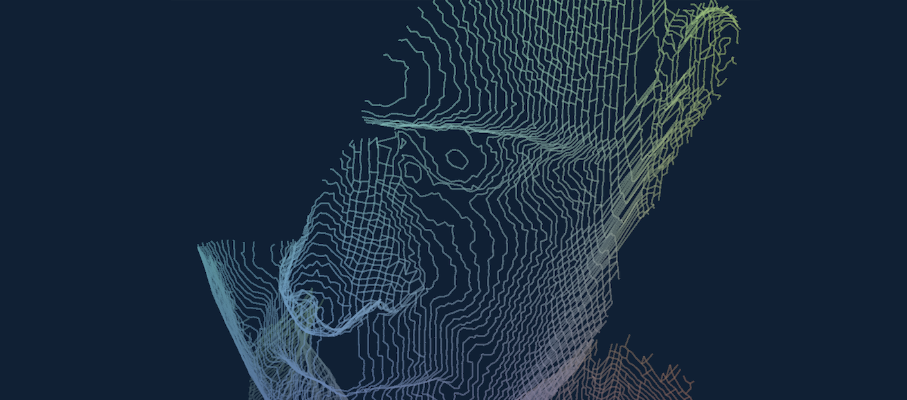

  

# PointAnimate

PointAnimate is a creative point cloud app for viewing, editing, and turning 3D scans into animated VFX and particle visuals.

It combines practical point cloud tools with built-in animations, experimental visual styles, and live AR effects for visual artists, VJs, and anyone working creatively with 3D point data.

## Feedback

Found a bug or have an idea for a new animation or visual effect? Open an issue in this repository.

VJ, TouchDesigner, and point-cloud effect ideas are especially welcome.

## Using PointAnimate

### Viewer + Editor

Open a point cloud and inspect it in 3D before using it for visuals.

- Rotate, pan, and zoom around the point cloud
- Crop and segment unwanted areas
- Remove noise and outlier points
- Measure distances
- Save or export your edited point cloud

### Animation + VFX

Turn a static point cloud into an animated visual.

- Choose from built-in point cloud animations and effects
- Tune the settings and controls for each animation
- Transform points into styles such as **lines, contours, and vein-like structures**
- Rotate and reposition the point cloud
- Save effect settings as presets
- Create visuals for generative art and VJ workflows

**Coming soon:** NDI output for sending PointAnimate visuals to TouchDesigner and other live visual tools.

### AR + Live Point Cloud

Use the camera and depth data to create point cloud effects from the real world.

- Live point cloud visualization
- AR-style point cloud effects
- Slit-scan and temporal effects
- Depth-based experimental visuals

> Some live depth features require an iPhone or iPad with a LiDAR sensor.

## Supported Point Cloud Formats

PointAnimate currently supports **PLY, E57, LAS, LAZ, PTS, XYZ, FBX,  and OBJ** point clouds, including point position and color data when available.

Files can be opened from the iOS Files app.
